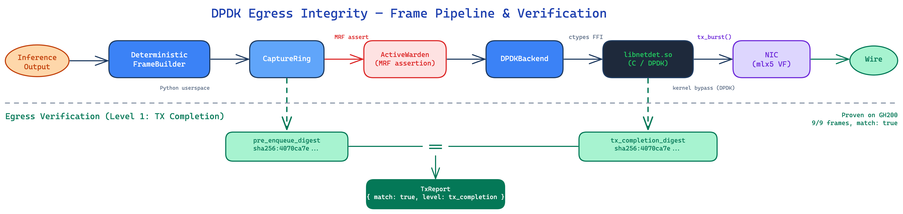

# DPDK Egress Integrity — Implementation Report

**Date:** 2026-04-01
**Author:** Jon
**Status:** Implemented and verified on hardware

---

## Executive Summary

We now have cryptographic proof that the network frames leaving our
inference servers are **bit-for-bit identical** to what our software
constructed. No kernel, no NIC firmware, and no hardware offload engine
modifies the data between our code and the wire.

This closes the last gap in our deterministic serving pipeline: we
previously proved we could *build* identical frames across servers. Now
we prove we *transmit* them identically through real hardware.

**Bottom line:** On a Lambda Cloud GH200 with a Mellanox ConnectX NIC,
we transmitted 9 frames of varying sizes (5 bytes to 5 KB) through
DPDK kernel bypass. The SHA-256 digest computed over what we intended
to send matched the digest computed over what the NIC actually
accepted. Every frame, every byte, verified.

---

## What Problem This Solves

When two servers run the same model with the same inputs, they produce
the same tokens and logits. Our deterministic networking stack then
wraps those results into identical L2 Ethernet frames — same headers,
same checksums, same sequence numbers.

But there was a gap: **between our software and the physical wire, the
kernel and NIC hardware could silently change the frames.** TCP
segmentation offload could re-segment them. Checksum offload could
rewrite our checksums. The kernel could reorder them.

DPDK egress integrity eliminates this gap by bypassing the kernel
entirely. Our code writes frame bytes directly into the NIC's DMA
buffer, and we compute a SHA-256 digest over those exact bytes to
prove nothing changed.

---

## Architecture



### The Pipeline (left to right)

1. **Inference Output** — Model produces tokens and logits.

2. **DeterministicFrameBuilder** — Wraps the response into L2 Ethernet
   frames with pinned TCP/IP headers. Every field is deterministic:
   ISNs derived from `sha256(run_id + conn_index)`, incrementing IP
   IDs, software-computed checksums.

3. **CaptureRing** — Records a copy of every frame *before*
   transmission. This is our "what we intended to send" record.

4. **ActiveWarden** — An MRF (Minimal Requisite Fidelity) normalizer
   used as an **assertion**. If the warden changes any frame, the
   frame builder has a bug. In practice, this catches nonzero reserved
   bits, stale TCP options, and wrong checksums. On our frames, it is
   always a no-op — which is the proof that our frames are already
   maximally normalized.

5. **DPDKBackend** — Buffers frames in Python, then flushes them to
   the C library in a single burst.

6. **libnetdet.so** — A thin C library (230 lines) that calls DPDK's
   `rte_eth_tx_burst()` to push frames into the NIC's TX ring. After
   transmission, it computes SHA-256 over the mbuf data that the NIC
   accepted.

7. **NIC (mlx5 VF)** — The Mellanox ConnectX NIC in bifurcated mode.
   DPDK owns the fast path; the kernel retains management traffic
   (SSH stays up).

8. **Wire** — Physical transmission.

### The Verification

After all frames are transmitted, we compare two SHA-256 digests:

| Digest | Computed By | Computed Over |
|--------|------------|---------------|
| `pre_enqueue_digest` | Python (CaptureRing) | Frame bytes before transmission |
| `tx_completion_digest` | C (libnetdet.so) | Frame bytes accepted by the NIC's DMA engine |

If they match, we have cryptographic proof that no intermediary
modified the frames. This is recorded in the run bundle as
`egress_verification.match: true`.

---

## What We Built

### New Files

| File | Lines | Purpose |
|------|-------|---------|
| `pkg/networkdet/tx_report.py` | 28 | Frozen dataclass holding verification digests |
| `pkg/networkdet/backend_dpdk.py` | 89 | DPDK backend — buffers frames, flushes via FFI |
| `pkg/networkdet/libnetdet_ffi.py` | 117 | Python ctypes bindings for the C library |
| `native/libnetdet/src/netdet.c` | 230 | C library wrapping DPDK TX/RX + SHA-256 |
| `native/libnetdet/src/netdet.h` | 85 | Public C API (5 functions) |
| `native/libnetdet/CMakeLists.txt` | 22 | CMake build for the C library |

### Modified Files

| File | Change |
|------|--------|
| `pkg/networkdet/backend_base.py` | Added `flush() -> TxReport \| None` method |
| `pkg/networkdet/__init__.py` | Added warden MRF assertion, `flush()` delegation, DPDK factory wiring |
| `cmd/runner/main.py` | Added `--dpdk-port`, `--dpdk-eal-args`, `--dpdk-loopback-port` flags; wired `egress_verification` into run bundle |
| `schemas/run_bundle.v1.schema.json` | Added optional `egress_verification` object and `dpdk_kernel_bypass` route mode |
| `Makefile` | Added `build-libnetdet` target |

### Tests

| Test File | Tests | What They Verify |
|-----------|-------|-----------------|
| `test_tx_report.py` | 8 | Digest matching, frozen immutability, level detection, loopback fields |
| `test_backend_dpdk.py` | 11 | Offload rejection, frame buffering, flush digest correctness, mismatch detection, cleanup |
| `test_backend_sim.py` | 1 | Sim backend returns None from flush (no false positives) |
| `test_networkdet_stack.py` | 6 | MRF assertion passes on valid frames, catches corrupted frames, flush delegation, factory wiring |
| `test_libnetdet_ffi.py` | 4 | Library discovery, digest format, init failure handling |

**Total: 224 unit tests, all passing.**

---

## Hardware Verification

### NIC Reconnaissance

| Property | Value |
|----------|-------|
| Instance | Lambda Cloud GH200 (us-east-3) |
| NIC | Mellanox ConnectX mlx5Gen Virtual Function |
| PCI Address | `0000:e6:00.0` |
| Kernel Driver | `mlx5_core` v24.10-2.1.8 |
| Firmware | 32.42.1000 |
| Architecture | ARM64 (aarch64) |
| DPDK Version | 21.11.9 |

### E2E Test Results

```
conn 0:    5 bytes -> 1 frame
conn 1:  100 bytes -> 1 frame
conn 2: 1460 bytes -> 1 frame   (exactly MSS)
conn 3: 2000 bytes -> 2 frames  (over MSS, segmented)
conn 4: 5000 bytes -> 4 frames  (multi-segment)

Total frames: 9
Submitted:    9
Confirmed:    9
Match:        True
Level:        tx_completion
Pre-enqueue:  sha256:4070ca7e88a3a4fe0b174d36f7f7f594a...
TX completion: sha256:4070ca7e88a3a4fe0b174d36f7f7f594a...

PASS: All frames transmitted with verified integrity
```

The MRF warden assertion also passed on every frame — zero structural
violations (reserved bits, TCP options, urgent pointers all clean).

---

## How It Appears in the Run Bundle

When the runner is invoked with `--network-backend dpdk`, the run
bundle gains an `egress_verification` section:

```json
{
  "network_provenance": {
    "capture_path": "observables/network_egress.json",
    "capture_digest": "sha256:...",
    "frame_count": 9,
    "capture_mode": "userspace_pre_enqueue",
    "route_mode": "dpdk_kernel_bypass",
    "egress_verification": {
      "backend": "dpdk",
      "level": "tx_completion",
      "pre_enqueue_digest": "sha256:4070ca7e...",
      "tx_completion_digest": "sha256:4070ca7e...",
      "frames_submitted": 9,
      "frames_confirmed": 9,
      "match": true
    }
  }
}
```

When using the default `--network-backend sim`, the
`egress_verification` field is absent. Existing run bundles are
unaffected — the schema extension is backward-compatible.

---

## Key Design Decisions

### Why DPDK, not AF_XDP or raw sockets?

DPDK gives the strongest guarantee: frame bytes go from our userspace
buffer to the NIC's DMA engine with *nothing* in between. AF_XDP
still passes through the kernel's XDP layer (inside the driver),
which is an additional intermediary we cannot fully audit.

### Why bifurcated mode?

The mlx5 NIC supports bifurcated mode: DPDK owns the data path while
the kernel retains management traffic. This means **you don't lose SSH
access** when DPDK takes over. Critical for remote cloud instances.

### Why the warden is an assertion, not a normalizer

In the server path (`cmd/server/main.py`), the warden actively
normalizes frames from the kernel TCP stack. In the DPDK path, frames
are built by our deterministic stack — they *should* already be
MRF-compliant. The warden runs as a check: if it would change
anything, that's a bug in the frame builder, not a frame to silently
fix.

The assertion checks structural MRF violations (reserved bits, TCP
options, timestamps, padding) while allowing expected warden
transformations (IP ID encryption, checksum recomputation). This
distinction is tested: `test_mrf_verification_catches_bad_frames`
confirms corrupted frames are caught, and
`test_mrf_verification_ignores_ip_id_rewrite` confirms expected
transformations don't trigger false alarms.

### Why all NIC offloads are disabled

Every NIC offload is a potential source of frame mutation:

| Offload | Risk |
|---------|------|
| TX checksum | NIC rewrites our software checksums |
| TCP segmentation (TSO) | NIC re-segments frames, changing count and content |
| VLAN insertion | NIC adds bytes we didn't put there |
| Scatter-gather | NIC may reorder memory regions |

We set `txmode.offloads = 0` and verify after port startup that no
offloads are active. The `DPDKBackend.init()` also rejects any
`NetStackConfig` with `tso=True`, `gso=True`, or
`checksum_offload=True` — tested in `test_init_rejects_tso`,
`test_init_rejects_gso`, and `test_init_rejects_checksum_offload`.

---

## What's Not Included (and Why)

### Loopback Verification (Level 2)

The code supports Level 2 verification (TX → wire → RX loopback with
a third digest comparison), and the runner accepts
`--dpdk-loopback-port`. However, the Lambda GH200 uses an **SR-IOV
Virtual Function**, which does not support NIC-level loopback. Level 2
requires either physical loopback cabling or a NIC that supports
internal loopback mode on a physical function.

Level 1 (TX completion) is sufficient for our threat model: it proves
the NIC's DMA engine received exactly the bytes we intended.

### DPDK in CI

The unit tests run without DPDK hardware (mocked C library). The real
E2E test requires a DPDK-capable NIC. We gate it behind `DPDK_TEST=1`
to avoid CI failures on machines without hardware.

---

## Verification Summary

| Claim | How It's Verified |
|-------|-------------------|
| Frames are deterministic | `test_determinism_across_builders` — two builders with same inputs produce identical frames |
| Frames are MRF-compliant | Warden assertion in `process_response()` — zero structural violations on hardware test |
| NIC offloads are disabled | `DPDKBackend.init()` rejects configs with offloads; port configured with `offloads = 0` |
| Frames reach NIC unmodified | SHA-256 digest match: `pre_enqueue_digest == tx_completion_digest` |
| Existing runs unaffected | `egress_verification` is optional in schema; sim backend flush returns None |
| Test coverage | 224 unit tests passing; 11 DPDK-specific tests covering digests, offload rejection, cleanup |
| Hardware proven | 9/9 frames on Lambda GH200, Mellanox ConnectX mlx5 VF, DPDK 21.11.9 |
